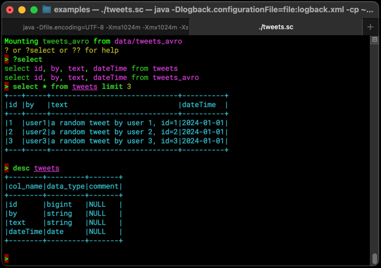

# Query
Query is a tool to view big data files (avro, parquet, orc, csv, json and all spark supported formats) as a database and query
them from an interactive console or scala ammonite scripts. It supports syntax colouring and basic autocomplete.
A single csv, json or avro file or spark-generated directories with parquet, orc, csv, avro data are supported. The tool
is written over spark sql 3 and supports the formats that spark supports and also auto-detects the columns of the
tables.

# Installation

`scala-cli` is the only requirement to use `query`. The recommended way is to checkout this repository and start modifying the
example scala-cli scripts in the examples directory:

```shell
git clone https://github.com/kostaskougios/query.git
cd query/examples
cat Readme.md
```

For example here is a script that mounts `tweets` tables in parquet and avro format:
[tweets.sc](examples/tweets.sc)


and this is the script that creates the sample tweets data:
[generate-sample-data.sc](examples/generate-sample-data.sc)

# Screenshots
## Ubuntu


## MacOs


