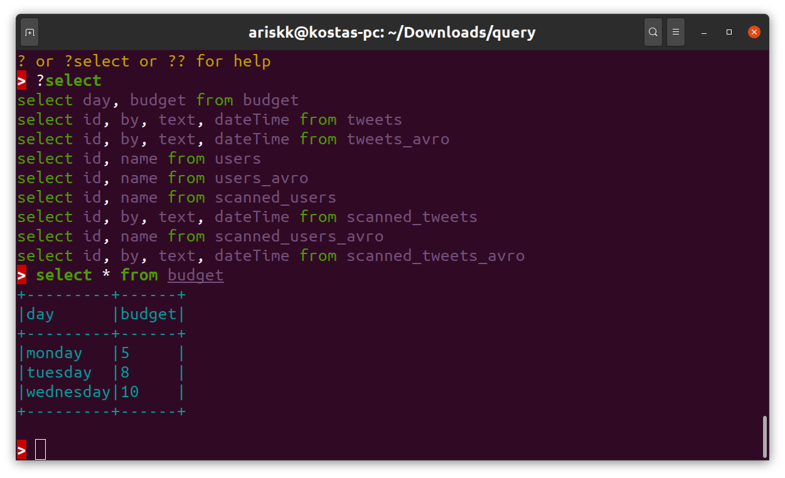
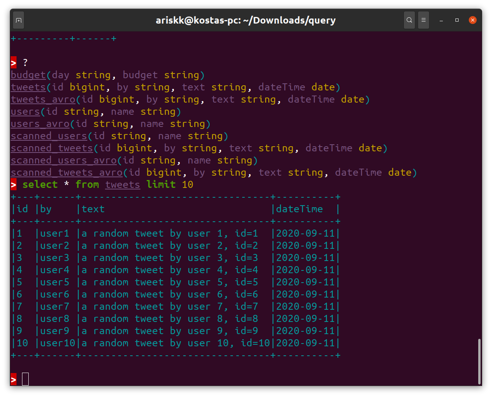

# Query
Query is a tool to view big data files (avro, parquet, orc, csv, json and all spark supported formats) as a database and query
them from an interactive console or scala ammonite scripts. It supports syntax colouring and basic autocomplete.
A single csv, json or avro file or spark-generated directories with parquet, orc, csv, avro data are supported. The tool
is written over spark sql 3 and supports the formats that spark supports and also autodetects the columns of the
tables.

An example scala ammonite script of how to mount different formats can be found [here](dist-folder/example.sc).
Table creation is also supported, see an [example script](dist-folder/sampledata.sc).




# Install on linux 64 bit

This will create a self-contained folder with the jdk, ammonite and the query tool. 

- download and unzip https://drive.google.com/uc?id=14ORaIU1mW-CbLSwySY7SNEuzMhir3FcK&export=download (open with browser)

```
cd UNZIPPED_FOLDER
bin/install

# now ready to run scripts
bin/amm example.sc
```

# Install on all platforms

- Install jdk 8 or 11 and ammonite for scala 2.12 from https://ammonite.io/#OlderScalaVersions
- download and unzip https://drive.google.com/file/d/14ORaIU1mW-CbLSwySY7SNEuzMhir3FcK/view?usp=sharing (open with browser). Follow the instructions of the Readme file inside the zip file.

Known issues: 
- Autocomplete is not context-aware, only table names and some sql keywords will be completed, also when pressing <tab> make sure to have a standalone
word (spaced from parenthesis, dots etc). it is though very useful!

# Build from source

- git clone https://github.com/kostaskougios/query.git
- install mill from http://www.lihaoyi.com/mill/
- run `bin/prepare-distro`
- `cd dist && ls` 
